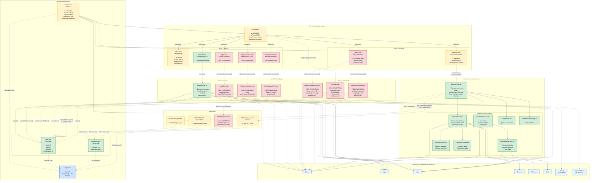

```mermaid
flowchart TD
    %% ============================================
    %% WARSTWA INFRASTRUKTURY
    %% ============================================
    subgraph INFRA["Warstwa Infrastruktury"]
        direction LR
        MIDDLEWARE["Middleware<br/>index.ts<br/><br/>⚠️ WYMAGA AKTUALIZACJI<br/>Odczyt cookies<br/>Weryfikacja sesji<br/>Ustawienie locals.user"]:::needsUpdate

        subgraph AUTH_CLIENTS["Klienty Autentykacji"]
            AUTH_CLIENT["authClient<br/>client-side<br/><br/>signUp()<br/>signIn()<br/>signOut()<br/>resetPassword()"]:::implemented
            SUPABASE_CLIENT["supabaseClient<br/>server-side<br/><br/>Operacje DB<br/>Admin operations"]:::implemented
        end

        SUPABASE["Supabase<br/><br/>Auth API<br/>PostgreSQL + RLS<br/>Storage"]:::infrastructure
    end

    %% ============================================
    %% WARSTWA ROUTINGU I LAYOUTU
    %% ============================================
    subgraph ROUTING["Warstwa Routingu i Layoutu"]
        direction TB
        LAYOUT["Layout.astro<br/><br/>⚠️ WYMAGA AKTUALIZACJI<br/>Warunkowa nawigacja<br/>UserMenu integration"]:::needsUpdate

        subgraph PUBLIC_PAGES["Strony Publiczne"]
            INDEX["index.astro<br/>Landing Page<br/><br/>⚠️ WYMAGA AKTUALIZACJI<br/>Przekierowanie zalogowanych"]:::needsUpdate
            REGISTER_PAGE["register.astro<br/>Strona Rejestracji<br/><br/>✅ Zaimplementowana"]:::implemented
            LOGIN_PAGE["login.astro<br/>Strona Logowania<br/><br/>🔴 DO UTWORZENIA"]:::toCreate
            FORGOT_PW_PAGE["forgot-password.astro<br/>Odzyskiwanie Hasła<br/><br/>🔴 DO UTWORZENIA"]:::toCreate
            RESET_PW_PAGE["reset-password.astro<br/>Resetowanie Hasła<br/><br/>🔴 DO UTWORZENIA"]:::toCreate
        end

        subgraph PROTECTED_PAGES["Strony Chronione"]
            GENERATE_PAGE["generate.astro<br/>Generowanie Fiszek<br/><br/>⚠️ WYMAGA AKTUALIZACJI<br/>Odkomentować ochronę"]:::needsUpdate
            PROFILE_PAGE["profile.astro<br/>Profil Użytkownika<br/><br/>🔴 DO UTWORZENIA<br/>Zmiana hasła<br/>Usuwanie konta"]:::toCreate
        end
    end

    %% ============================================
    %% MODUŁ AUTENTYKACJI
    %% ============================================
    subgraph AUTH_MODULE["Moduł Autentykacji"]
        direction TB

        subgraph AUTH_FORMS["Formularze Auth"]
            REGISTER_FORM["RegisterForm.tsx<br/><br/>✅ Zaimplementowany<br/>email, password<br/>signUp()<br/>Auto-redirect"]:::implemented
            LOGIN_FORM["LoginForm.tsx<br/><br/>🔴 DO UTWORZENIA<br/>email, password<br/>signInWithPassword()"]:::toCreate
            FORGOT_FORM["ForgotPasswordForm.tsx<br/><br/>🔴 DO UTWORZENIA<br/>email<br/>resetPasswordForEmail()"]:::toCreate
            RESET_FORM["ResetPasswordForm.tsx<br/><br/>🔴 DO UTWORZENIA<br/>password, confirm<br/>updateUser()"]:::toCreate
        end

        subgraph PROFILE_COMPONENTS["Komponenty Profilu"]
            USER_MENU["UserMenu.tsx<br/><br/>🔴 DO UTWORZENIA<br/>Dropdown menu<br/>Email display<br/>Link profilu<br/>Wylogowanie"]:::toCreate
            CHANGE_PW["ChangePasswordForm.tsx<br/><br/>🔴 DO UTWORZENIA<br/>current, new, confirm<br/>Weryfikacja obecnego<br/>updateUser()"]:::toCreate
            DELETE_ACC["DeleteAccountButton.tsx<br/><br/>🔴 DO UTWORZENIA<br/>Modal potwierdzenia<br/>Weryfikacja hasła<br/>DELETE API"]:::toCreate
        end
    end

    %% ============================================
    %% MODUŁ GENEROWANIA FISZEK
    %% ============================================
    subgraph GENERATE_MODULE["Moduł Generowania Fiszek"]
        direction TB

        GENERATE_VIEW["GenerateView.tsx<br/><br/>✅ Zaimplementowany<br/>Hook: useGenerateFlashcards<br/>Stan: viewState, cards, loading"]:::implemented

        subgraph GENERATE_COMPONENTS["Komponenty Generowania"]
            GENERATE_FORM["GenerateForm.tsx<br/><br/>Wprowadzanie tekstu<br/>Walidacja 1000-10000<br/>CharacterCounter"]:::implemented
            GENERATED_LIST["GeneratedCardsList.tsx<br/><br/>Lista fiszek<br/>Selekcja multiple<br/>Zapisywanie"]:::implemented
            CARD_ITEM["CardSuggestionItem.tsx<br/><br/>Pojedyncza fiszka<br/>Checkbox selection<br/>Front / Back"]:::implemented
            SELECTION_CTRL["SelectionControls.tsx<br/><br/>Zaznacz wszystkie<br/>Odznacz wszystkie"]:::implemented
            LOADING_STATE["LoadingState.tsx<br/><br/>Spinner + komunikat"]:::implemented
            EMPTY_MSG["EmptyResultsMessage.tsx<br/><br/>Brak wyników"]:::implemented
            CHAR_COUNTER["CharacterCounter.tsx<br/><br/>Licznik znaków<br/>Walidacja wizualna"]:::implemented
        end
    end

    %% ============================================
    %% KOMPONENTY WSPÓŁDZIELONE
    %% ============================================
    subgraph SHARED["Komponenty Współdzielone (shadcn/ui)"]
        direction LR
        UI_BUTTON["Button"]:::shared
        UI_INPUT["Input"]:::shared
        UI_LABEL["Label"]:::shared
        UI_TEXTAREA["Textarea"]:::shared
        UI_CHECKBOX["Checkbox"]:::shared
        UI_CARD["Card"]:::shared
        UI_DIALOG["Dialog<br/>(do dodania)"]:::shared
        UI_DROPDOWN["DropdownMenu<br/>(do dodania)"]:::shared
    end

    %% ============================================
    %% WARSTWA API
    %% ============================================
    subgraph API_LAYER["Warstwa API"]
        direction TB
        API_CARDS["POST/GET /api/cards<br/><br/>⚠️ Weryfikacja user_id"]:::needsUpdate
        API_CARD_ID["PATCH/DELETE /api/cards/[id]<br/><br/>⚠️ Weryfikacja własności"]:::needsUpdate
        API_GEN_REQ["POST /api/generation-requests<br/><br/>⚠️ user_id z locals"]:::needsUpdate
        API_DELETE_USER["DELETE /api/users/me<br/><br/>🔴 DO UTWORZENIA<br/>Weryfikacja hasła<br/>Kaskadowe usuwanie"]:::toCreate
    end

    %% ============================================
    %% PRZEPŁYW DANYCH - MIDDLEWARE
    %% ============================================
    MIDDLEWARE --> LAYOUT
    MIDDLEWARE --> PUBLIC_PAGES
    MIDDLEWARE --> PROTECTED_PAGES
    MIDDLEWARE --> API_LAYER

    MIDDLEWARE -.->|"Weryfikacja sesji"| SUPABASE
    AUTH_CLIENT -.->|"Auth API calls"| SUPABASE
    SUPABASE_CLIENT -.->|"DB operations"| SUPABASE

    %% ============================================
    %% PRZEPŁYW - LAYOUT I STRONY
    %% ============================================
    LAYOUT -->|"Renderuje"| INDEX
    LAYOUT -->|"Renderuje"| REGISTER_PAGE
    LAYOUT -->|"Renderuje"| LOGIN_PAGE
    LAYOUT -->|"Renderuje"| FORGOT_PW_PAGE
    LAYOUT -->|"Renderuje"| RESET_PW_PAGE
    LAYOUT -->|"Renderuje"| GENERATE_PAGE
    LAYOUT -->|"Renderuje"| PROFILE_PAGE

    LAYOUT -.->|"Integruje (gdy utworzony)"| USER_MENU

    %% ============================================
    %% PRZEPŁYW - STRONY DO KOMPONENTÓW AUTH
    %% ============================================
    REGISTER_PAGE -->|"client:load"| REGISTER_FORM
    LOGIN_PAGE -.->|"client:load (do utworzenia)"| LOGIN_FORM
    FORGOT_PW_PAGE -.->|"client:load (do utworzenia)"| FORGOT_FORM
    RESET_PW_PAGE -.->|"client:load (do utworzenia)"| RESET_FORM
    PROFILE_PAGE -.->|"client:load (do utworzenia)"| CHANGE_PW
    PROFILE_PAGE -.->|"client:load (do utworzenia)"| DELETE_ACC

    %% ============================================
    %% PRZEPŁYW - AUTH FORMS DO KLIENTÓW
    %% ============================================
    REGISTER_FORM -->|"signUp()"| AUTH_CLIENT
    LOGIN_FORM -.->|"signInWithPassword()"| AUTH_CLIENT
    FORGOT_FORM -.->|"resetPasswordForEmail()"| AUTH_CLIENT
    RESET_FORM -.->|"updateUser()"| AUTH_CLIENT
    CHANGE_PW -.->|"signInWithPassword()<br/>updateUser()"| AUTH_CLIENT
    USER_MENU -.->|"signOut()"| AUTH_CLIENT

    %% ============================================
    %% PRZEPŁYW - STRONY DO GENEROWANIA
    %% ============================================
    GENERATE_PAGE -->|"client:load<br/>userId, userEmail"| GENERATE_VIEW

    GENERATE_VIEW --> GENERATE_FORM
    GENERATE_VIEW --> GENERATED_LIST
    GENERATE_VIEW --> LOADING_STATE
    GENERATE_VIEW --> EMPTY_MSG

    GENERATE_FORM --> CHAR_COUNTER
    GENERATED_LIST --> CARD_ITEM
    GENERATED_LIST --> SELECTION_CTRL

    %% ============================================
    %% PRZEPŁYW - KOMPONENTY DO UI
    %% ============================================
    REGISTER_FORM --> UI_BUTTON
    REGISTER_FORM --> UI_INPUT
    REGISTER_FORM --> UI_LABEL

    LOGIN_FORM -.-> UI_BUTTON
    LOGIN_FORM -.-> UI_INPUT
    LOGIN_FORM -.-> UI_LABEL

    FORGOT_FORM -.-> UI_BUTTON
    FORGOT_FORM -.-> UI_INPUT
    FORGOT_FORM -.-> UI_LABEL

    RESET_FORM -.-> UI_BUTTON
    RESET_FORM -.-> UI_INPUT
    RESET_FORM -.-> UI_LABEL

    CHANGE_PW -.-> UI_BUTTON
    CHANGE_PW -.-> UI_INPUT
    CHANGE_PW -.-> UI_LABEL

    DELETE_ACC -.-> UI_BUTTON
    DELETE_ACC -.-> UI_DIALOG
    DELETE_ACC -.-> UI_INPUT

    USER_MENU -.-> UI_BUTTON
    USER_MENU -.-> UI_DROPDOWN

    GENERATE_FORM --> UI_BUTTON
    GENERATE_FORM --> UI_LABEL
    GENERATE_FORM --> UI_TEXTAREA

    GENERATED_LIST --> UI_BUTTON
    CARD_ITEM --> UI_CHECKBOX
    CARD_ITEM --> UI_CARD

    %% ============================================
    %% PRZEPŁYW - KOMPONENTY DO API
    %% ============================================
    GENERATE_VIEW -.->|"POST generation-requests<br/>POST cards (save)"| API_GEN_REQ
    GENERATE_VIEW -.->|"POST cards (save)"| API_CARDS
    DELETE_ACC -.->|"DELETE (do utworzenia)"| API_DELETE_USER

    API_GEN_REQ -.->|"OpenRouter API"| SUPABASE
    API_CARDS -.->|"DB operations"| SUPABASE_CLIENT
    API_CARD_ID -.->|"DB operations"| SUPABASE_CLIENT
    API_DELETE_USER -.->|"DB + Auth admin"| SUPABASE_CLIENT

    %% ============================================
    %% STYLE DEFINITIONS
    %% ============================================
    classDef implemented fill:#d4edda,stroke:#28a745,stroke-width:2px,color:#000
    classDef needsUpdate fill:#fff3cd,stroke:#ffc107,stroke-width:2px,color:#000
    classDef toCreate fill:#f8d7da,stroke:#dc3545,stroke-width:2px,color:#000
    classDef infrastructure fill:#cfe2ff,stroke:#0d6efd,stroke-width:2px,color:#000
    classDef shared fill:#e7f3ff,stroke:#0066cc,stroke-width:1px,color:#000
```
